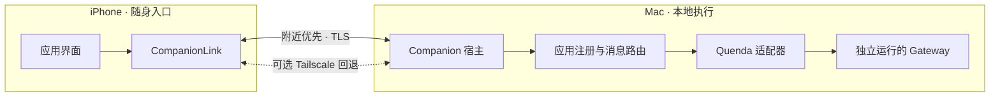
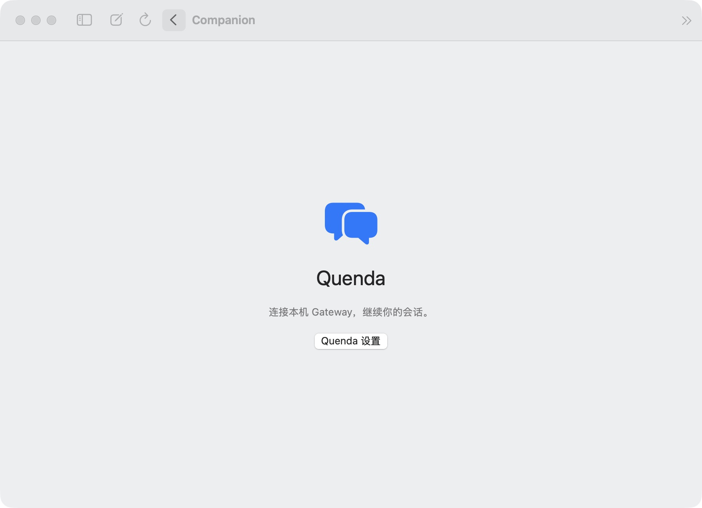
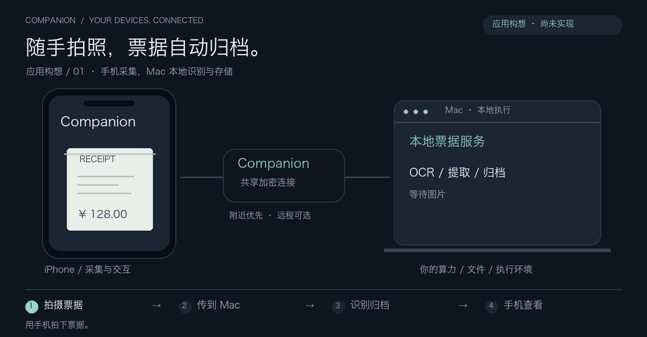
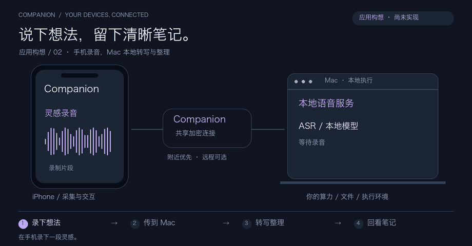

<div align="center">


# Companion

### 你的电脑负责运行，你的手机随时接入。

让个人应用跨越 Mac 与 iPhone，使用自己的算力、执行环境和设备。


[快速开始](docs/getting-started.md) · [应用接入](docs/application-architecture.md) · [连接协议](docs/connection-protocol.md)

</div>

## 为什么做 Companion

随着个人 coding 越来越普遍，每个人的电脑上都会出现越来越多为自己写的应用：一个研究助手、一套文件整理工具、一个本地 AI 服务，或者一个记录生活的小程序。

我们希望这些应用能自然地延伸到手机。电脑提供算力、文件和执行环境；手机提供随身的屏幕，并在未来通过统一能力接口接入摄像头、麦克风等设备。开发者专注于应用，Companion 负责两端之间的连接。

**目标是让你写出的应用，运行在自己的设备上，随时从手机使用。** 对于完全本地处理的应用，无需租用云端计算环境；是否调用云模型或外部服务，由应用自身决定。

> 当前版本提供原生 Mac / iPhone 应用宿主、共享配对和加密连接，首个内置应用是 Quenda。摄像头、录音能力接口、动态应用安装和应用市场仍在规划中。

## 看它如何工作

打开 Quenda，发送任务，在手机确认工具权限，接收 Mac 上独立 Gateway 的返回结果。


*已有交互能力的流程示意，非实际界面录屏。*

## 现在可以做什么

| 能力 | 当前实现 |
| --- | --- |
| 统一应用入口 | 两端首页展示应用，每个应用拥有独立设置 |
| 一次设备配对 | 应用共用设备身份和 TLS 连接，密钥保存在钥匙串 |
| 附近优先 | 通过 Bonjour 发现附近 Mac，使用 Network framework 连接 |
| 远程回退 | 可选 Tailscale；附近发现或握手失败后尝试远程地址 |
| 应用消息路由 | 按应用 ID 分发请求、响应和事件，隔离应用会话 |
| 连接恢复 | 手机返回前台恢复连接，不自动重发业务命令 |
| Quenda | 历史消息、流式聊天、工具活动、权限确认、交互回复与停止回答 |

附近连接也可能经过共同局域网；发现成功并不代表已验证无线点对点路径。Mac 需要保持运行和唤醒。

## 两端界面

<table>
  <tr>
    <th>Mac · 管理应用与本地连接</th>
    <th>iPhone · 随身打开应用</th>
  </tr>
  <tr>
    <td align="center"></td>
    <td align="center"></td>
  </tr>
  <tr>
    <td>向配对设备开放应用，统一管理连接。</td>
    <td>连接自己的 Mac，进入 Quenda。</td>
  </tr>
</table>

## 两端如何协作



设备连接与应用业务分别管理。Quenda 不可用时，Companion 仍可接受设备连接；修改一个应用的配置不会关闭其他应用的设备连接。应用负责自己的任务、数据持久化与业务恢复。

### 第一个应用：Quenda

从手机继续电脑上的 Agent 会话，查看执行进度，在需要时确认工具权限。Mac 直接访问本机 Gateway，iPhone 通过已配对的 Companion 访问。

<details>
<summary>查看 Quenda 的 Mac 入口</summary>



</details>

Quenda Gateway 独立运行。Companion 不嵌入 Python，也不自动启动或停止 Gateway。

## 快速开始

需要 **macOS 14+、iOS 17+、Swift 6 编译工具**。iPhone 构建和安装需要 Xcode 与开发签名。

```sh
git clone https://github.com/AgentDaily/companion.git
cd companion
scripts/build-apps.sh
open build/Companion.app
```

构建脚本同时编译 Mac App 与未签名 iOS SDK 产物；后者不能直接安装到手机。

在 Xcode 中打开 `Apps/iOS/QuendaCompanion.xcodeproj`，选择 `QuendaCompanion` scheme 和自己的开发 Team，然后在 iPhone 上运行。也可在完成开发签名配置后执行：

```sh
scripts/install-iphone.sh YOUR_TEAM_ID
```

1. 在 Mac 首页进入「设备连接与配对」，点击「开启手机连接」。
2. 两台设备开启 Wi-Fi，并允许 Companion 访问本地网络。
3. 用 iPhone 相机扫描配对二维码，或在手机 App 中粘贴配对链接。
4. 两端进入「Quenda」。在 Mac 的 Quenda 设置中配置本机 Gateway，并开启向手机共享。

附近连接无需 Tailscale、个人热点或互联网。需要远程访问时，在设备设置中启用 Tailscale 回退，并让两端加入自己的 Tailnet。

[完整安装说明、连接细节与故障边界 →](docs/getting-started.md)

## 开发你的应用

当前应用随 Companion 一起编译发布。新增应用需要实现 Mac 端业务会话、手机界面与共享连接适配，并注册两端的应用入口。

| 接口 | 用途 |
| --- | --- |
| `CompanionApplication` | 声明稳定 ID、名称、简介、图标与启用状态 |
| `ApplicationRegistry.register` | 注册 Mac 端应用和设备会话工厂 |
| `CompanionApplicationSession` | 处理应用请求，清理设备观察资源 |
| `CompanionLink.request` | 通过共享设备连接发送一次请求 |
| `CompanionLink.events(applicationID:)` | 订阅指定应用的事件 |

Mac 发布应用目录不会自动为旧 iPhone 客户端安装新界面。独立应用包与运行时安装将是后续工作的重点。

[阅读应用接入结构 →](docs/application-architecture.md)

## 可以长出什么应用？

下面是基于平台方向的应用构想，**尚未实现**。摄像头、录音、文件传输与对应本地服务仍需接入；动画展示目标流程。

### 拍照票据夹

手机拍摄票据，Mac 使用本地 OCR 提取金额和分类、保存文件，手机查看归档结果。适合个人报销、消费记录与资料整理。

<details>
<summary>播放票据归档流程</summary>



</details>

### 语音灵感笔记

手机录下一段想法，Mac 使用本地 ASR 转写，并可选用本地模型整理重点与待办，文本回到手机。

<details>
<summary>播放语音笔记流程</summary>



</details>

同样的协作方式还可以用于随身论文助手、家庭相册搜索、文件整理和个人自动化。应用决定业务，Companion 提供设备之间的底座。

## 路线图

我们希望最终形成这样的体验：**开发者上传应用 → 用户在手机点安装 → Mac 准备执行环境 → 两端打开即用。**

- [x] Mac / iPhone 原生宿主与应用列表
- [x] 共享配对、TLS 传输、附近优先与远程回退
- [x] 应用注册、消息路由与首个 Quenda 应用
- [ ] 手机摄像头、录音与文件传输的统一能力接口
- [ ] 独立应用包、Mac 运行环境管理与权限隔离
- [ ] 个人应用导入、安装、更新与卸载
- [ ] 应用市场：发布、发现、版本管理与可信分发

应用市场是平台的下一阶段。当前版本尚不支持下载和执行第三方插件；iPhone 动态应用与原生能力开放的分发方案也需要验证。

## 数据与连接

配对密钥保存在设备钥匙串。二维码和配对链接包含访问密钥，请只交给自己的设备，不要放进截图或公开仓库。重置密钥会使旧配对失效。

远程模式使用私有 Tailscale Serve，不启用公网 Funnel。Companion 的本地连接设计不等于所有应用都离线：接入的模型、Gateway 和其他业务服务仍可能联网。第三方应用的权限与执行隔离尚待实现。

## 开发与验证

项目测试使用 Conda 环境 `kora`：

```sh
conda run -n kora swift test
conda run -n kora scripts/test.sh
conda run -n kora scripts/build-apps.sh
```

`test.sh` 启动隔离的 Gateway fixture，验证聊天、权限、交互与连接恢复，不调用模型。测试还覆盖应用路由、TLS 认证、帧大小和连接回退。无线点对点、锁屏、网络切换和耗电表现仍需真机验证。

```text
Sources/
  CompanionCore/         配对、传输、应用注册、消息路由与 Quenda 适配器
  CompanionUI/           共享状态、设备连接与 Quenda 界面
  QuendaCompanionMac/    Mac 宿主、应用首页与菜单栏
Apps/iOS/                iPhone 宿主与 Xcode 工程
Tests/                   单元测试与隔离 Gateway fixture
scripts/                 构建、设备安装与测试脚本
docs/                    接入文档、协议、调研与真实界面截图
```

---

<div align="center">

**让个人应用，在自己的设备之间自由流动。**

Built by [AgentDaily](https://github.com/AgentDaily)

</div>
