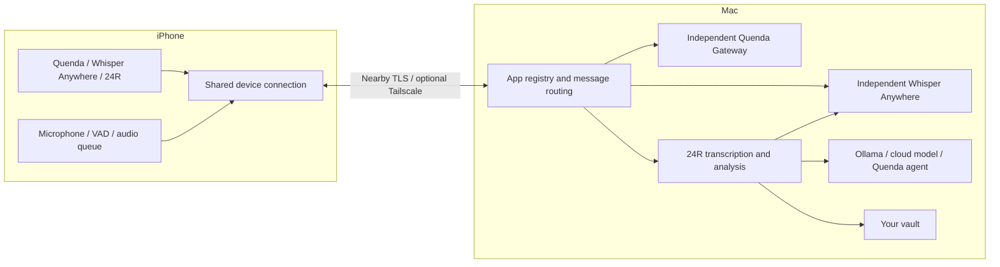

<div align="center">


# Companion

**English** · [简体中文](README.zh-CN.md)

### Your Mac does the work. Your iPhone keeps you connected.

Native macOS and iOS apps for AI agents, local voice input, and daily audio notes.
Built with Swift and SwiftUI. Powered by your own Mac.


[Quick start](#quick-start) · [AI agents](#quenda--your-ai-agents-on-iphone) · [Voice input](#whisper-anywhere--your-iphone-as-a-mac-microphone) · [24R daily notes](#24r--audio-notes-and-daily-reviews) · [Development](#development)

</div>

## What is Companion?

Companion connects your iPhone to apps running on your Mac. Chat with your self-hosted AI agents, dictate into Mac apps using your phone's microphone, or turn spoken moments into searchable transcripts, summaries, and daily notes.

Your Mac provides the compute, files, and execution environment. Your iPhone provides a portable interface and microphone. Apps share device pairing and an encrypted connection while managing their own tasks and data.

| App | What you can do | Required on your Mac |
| --- | --- | --- |
| **Quenda** | Chat with AI agents, stream responses, approve tool requests, and manage projects and models | A separately running Quenda Gateway |
| **Whisper Anywhere** | Use your iPhone as a wireless microphone for speech-to-text in Mac apps or Quenda drafts | A compatible standalone Whisper Anywhere app |
| **24R** | Capture speech, browse transcripts, generate hourly summaries and daily reviews, and keep notes and tasks in your own vault | Whisper Anywhere for transcription; optionally Ollama, a cloud model, or a Quenda agent for analysis |

Current version: **0.5.8 (build 24)**. Companion is in early development. Apps ship with the host; dynamic installation of third-party apps is not available yet.

> **Connection status:** Shared local networks, including a Mac connected to an iPhone hotspot, and optional Tailscale fallback are available. Version 0.5.8 fixes a peer-to-peer discovery lifetime issue. In a device comparison over Apple Wireless Direct Link (AWDL), discovery still worked after 93 seconds idle with the fix, while the previous behavior timed out. USB transport was excluded from that test. Reliable operation without a shared network, all-day background use, and battery life still need broader device testing. [Connection diagnostics (Chinese)](docs/nearby-connection-diagnostics.md).

## A native app on both devices

<table>
  <tr>
    <th>Mac · Apps and local connections</th>
    <th>iPhone · Your apps on the go</th>
  </tr>
  <tr>
    <td align="center"></td>
    <td align="center"></td>
  </tr>
</table>

These screenshots show an earlier version. Whisper Anywhere and 24R have since been added.

<details>
<summary>See the Quenda interaction flow</summary>


This animation illustrates the workflow; it is not a recording of the actual UI.

</details>

## Quick start

You need **macOS 14+, iOS 17+, Swift 6 build tools**, and Xcode with an iOS SDK. Installing on an iPhone requires your own development signing configuration.

### 1. Build and open the Mac app

```sh
git clone https://github.com/AgentDaily/companion.git
cd companion
scripts/build-apps.sh
open build/Companion.app
```

The build script produces the Mac app and an unsigned iOS SDK build. The generated `build/iOS-SDK/QuendaCompanion.app` cannot be installed directly on an iPhone.

### 2. Install the iPhone app

Open `Apps/iOS/QuendaCompanion.xcodeproj` in Xcode. Select the `QuendaCompanion` scheme, your development Team, and your iPhone, then run the app. Enable Developer Mode on the phone when required.

Once development signing is configured, you can also use:

```sh
scripts/install-iphone.sh YOUR_TEAM_ID
# With multiple devices, specify the device name or UDID:
scripts/install-iphone.sh YOUR_TEAM_ID 'Your iPhone Name'
```

### 3. Pair your devices

1. On the Mac home screen, open device connection and pairing settings and enable phone connections.
2. For the first connection, put both devices on the same reachable local network and allow local network access. The network itself does not need internet access.
3. Scan the pairing QR code with your iPhone camera, or paste the pairing link into the iPhone app.
4. Start Quenda Gateway or Whisper Anywhere as needed, then check the connection inside the corresponding Companion app.
5. For 24R, choose a Mac vault folder and optionally configure an analysis model before recording.

For remote access, enable Tailscale fallback and join both devices to your own tailnet. Your Mac must remain running and awake. Peer-to-peer operation with Wi-Fi enabled but no shared network still has known issues; see the connection status above.

[Detailed setup guide (Chinese) →](docs/getting-started.md)

## Quenda — your AI agents on iPhone

- Browse agents, projects, and conversations; create sessions and read paginated history and streaming responses.
- Inspect tool activity, approve permission requests, answer interactive questions, and stop a response.
- Configure providers, API keys, and the default model; choose a project and model for new conversations.
- Read Markdown, quotes, and code blocks. Attach photos and files with transfer progress: up to 6 attachments and 8 MB total per message, with photo compression.
- Dictate into a draft through Whisper Anywhere, review it, then send it yourself. Failed sends keep the draft; business commands are not automatically sent again.

Quenda Gateway runs independently. Companion does not embed Python or automatically start or stop the Gateway. Device pairing and connectivity remain available when the Gateway is offline.

## Whisper Anywhere — your iPhone as a Mac microphone

Open the standalone Whisper Anywhere app on your Mac and wait for its model to load. Select a text field on the Mac, then start and finish a recording in Companion on your iPhone. Configure the model, language, and Accessibility permissions in Whisper Anywhere.

Companion sends audio to your Mac for local speech recognition. The standalone voice input screen shows recording and completion status; Quenda can show a transcription preview and place the final text in a draft. Recognition quality depends on the model and backend in the external Whisper Anywhere app.

Voice input is intended for short foreground sessions, up to 10 minutes each. Cancellation, system interruptions, or disconnection cancel the current session without automatically retrying text insertion. System voice processing is configurable on the phone. Voice input cannot run while 24R owns the microphone.

This repository includes the Companion adapter, **not the standalone Whisper Anywhere app or its speech recognition models**. Use compatible versions. For 24R, the recognition service must support processing audio without writing it to disk.

## 24R — audio notes and daily reviews

### From speech to a daily review

1. **Detect speech on your iPhone.** Local Silero voice activity detection (VAD) avoids sending silence-only segments.
2. **Transcribe in segments.** A segment ends after roughly 3 seconds without speech; continuous speech is submitted about every 60 seconds. Your Mac transcribes it through Whisper Anywhere, and the text becomes available on your phone.
3. **Generate hourly summaries.** Short summaries and evidence-based mood, scene, and topic tags help you revisit the day.
4. **Review your day.** A daily review runs at 21:30 by default, with a configurable time and a manual trigger. It covers the sequence of activities, key events, mood cues, difficulties and responses, progress, and tasks.

Mood and activity analysis is based on transcript text. Without location evidence, 24R summarizes the order of activities; it does not record a GPS route or diagnose emotions or health conditions from your voice. Linking to historical context requires enabling it in settings.

### Choose how to analyze your notes

| Option | Configuration | How it works |
| --- | --- | --- |
| **Ollama** | A server URL reachable from your Mac, model, and keep-alive duration | A staged workflow makes multiple model calls and combines the results |
| **Cloud model** | An OpenAI-compatible base URL, model, and API key | The same staged analysis workflow |
| **Quenda agent** | A dedicated agent ID, with optional workspace, provider, and model | The agent receives an analysis objective and organizes its own reasoning and tool use |

For Ollama, `127.0.0.1` refers to your Mac. API keys are stored in the Mac Keychain. Recording and transcription work without an analysis model. Choosing a cloud service sends the text used for analysis to that service.

### Audio storage and offline recovery

By default, 24R **does not retain raw audio long term**. Completed segments wait in a persistent queue on your phone until the Mac acknowledges processing and the phone saves the transcript. The queued audio is then deleted. If the Mac disconnects, segments remain queued and upload in order after reconnection; failures do not simply discard the cache.

- You can explicitly retain subsequent audio manually or through enabled keyword triggers. Retention is not retroactive by default. Keyword triggers depend on Mac transcription and cannot act immediately while offline.
- Queued audio is 16 kHz mono PCM16: roughly **115 MB per hour** of segments, or **2.76 GB for 24 hours** of continuous segments. Actual storage depends on detected speech duration.
- Recording pauses with a warning at the 4 GB cache limit or when free space falls below roughly 128 MB; existing queued audio is not deleted.
- Completed segments survive app restarts. The unfinished in-memory tail, up to about a minute, can still be lost if the app is force-quit or terminated by the system.

You can select built-in, USB, wired, or Bluetooth microphones exposed by iOS. Compatibility depends on the input capabilities of each device. Background recording and recovery from system interruptions are implemented, but recording cannot be guaranteed during calls or while another app exclusively owns the microphone. All-day locked-screen operation, battery use, and individual Bluetooth devices still need validation.

### Keep your notes in your own vault

Choose a folder on your Mac to store an Obsidian-style vault:

```text
24R/
  Transcripts/YYYY-MM-DD.json   # Editable source transcripts
  Transcripts/YYYY-MM-DD.md     # Generated reading view
  Hourly/YYYY-MM-DD.md          # Hourly summaries and tags
  Reports/YYYY-MM-DD.md         # Daily reviews
  Tasks/YYYY-MM-DD.md           # Tasks and checkbox states
  .24r-vault.json               # Vault format metadata
```

Once selected, the vault is the **Mac's source of truth**, not an extra export. In-app changes and external file edits are reflected in both directions. Companion only processes date-based files in its designated directories, leaving other folders available for your own notes and agent output. Your iPhone keeps a copy for offline reading.

Edit transcript JSON to change the source text; the matching Markdown file is a reading view. Preserve format metadata when editing reports and hourly notes. If the vault is unavailable or damaged, Companion reports the problem instead of silently writing to old internal storage.

[24R usage and implementation details (Chinese) →](docs/24r.md) · [Static design prototype (Chinese) →](docs/prototypes/24r/README.md)

## How the devices work together



Changing one app's configuration does not deliberately close the shared connection for other apps. Each app handles its own recovery: chat commands are not automatically replayed, while 24R uses a persistent queue, acknowledgements, and segment IDs to avoid duplicate processing during retries.

## Development

Use the `kora` Conda environment for project tests. The isolated Gateway fixture requires `fastapi`, `uvicorn`, and `websockets` in that environment.

```sh
conda run -n kora swift test
conda run -n kora scripts/test.sh
conda run -n kora scripts/build-apps.sh
```

`scripts/test.sh` starts a temporary Gateway fixture to validate chat, permissions, interactive questions, and reconnection without calling a real model. Tests also cover TLS, app isolation, audio segmentation, offline queues, vault synchronization, analysis workflows, and microphone session isolation.

The previously recorded full test run for 0.5.8 reported **118 tests: 112 passed and 6 optional tests skipped**. Mac release, iPhone SDK, and signed device builds also passed at that checkpoint. These are historical results, not a guarantee for every checkout, and automated tests do not validate real wireless conditions, all-day background use, or battery life.

```text
Sources/
  CompanionCore/        Transport, app protocols, speech segmentation, 24R storage and analysis
  CompanionUI/          Shared UI, recording, and connection state
  QuendaCompanionMac/   Mac host and menu bar
Apps/iOS/               iPhone host and Xcode project
Tests/                  Unit tests, audio samples, and isolated Gateway fixture
Vendor/                 Third-party VAD code, sources, and licenses
scripts/                Build, installation, and test scripts
docs/                   Guides, protocols, prototypes, and diagnostics
```

Adding an app requires registering its Mac business session and implementing its UI on both platforms. The app catalog does not automatically install new interfaces on older clients. [Application architecture (Chinese)](docs/application-architecture.md).

## Data and third-party components

Pairing secrets and model API keys are stored in Keychain. Pairing QR codes and links contain access credentials; keep them private. Remote mode uses private Tailscale Serve and does not enable public Funnel. Local models can process data on your devices; cloud models and some agent tools use external services.

The repository bundles the Silero VAD Core ML model and libfvad source, so VAD does not require downloading a model at runtime. See the [Silero VAD notes](Vendor/SileroVAD/README.md), [libfvad notes](Vendor/Libfvad/README.md), and [third-party notices](Apps/iOS/ThirdPartyNotices.txt) for sources, versions, and licenses.

## Roadmap

- Improve discovery and connectivity without a router, network switching, and background device validation.
- Evaluate 24R transcription quality, microphone compatibility, and power use.
- Provide shared app capabilities for cameras, microphones, and file transfer.
- Explore independent app packages, runtimes, permission isolation, and installation and updates.

An app marketplace and dynamic third-party app installation are not implemented yet.

## Documentation

The detailed guides currently remain in Chinese:

- [Installation and setup](docs/getting-started.md)
- [24R recording, storage, and analysis](docs/24r.md)
- [Application architecture](docs/application-architecture.md)
- [Connection protocol](docs/connection-protocol.md)
- [Nearby connection diagnostics](docs/nearby-connection-diagnostics.md)

---

Built by [AgentDaily](https://github.com/AgentDaily)
