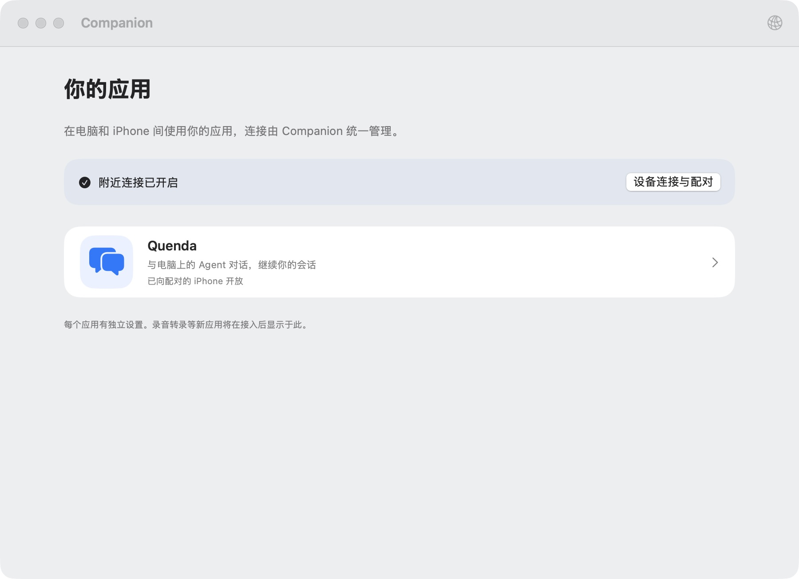
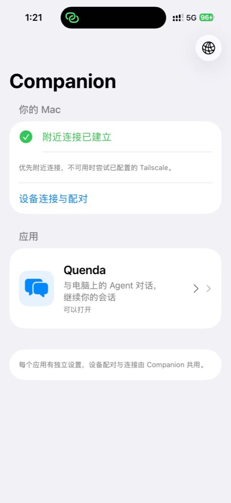
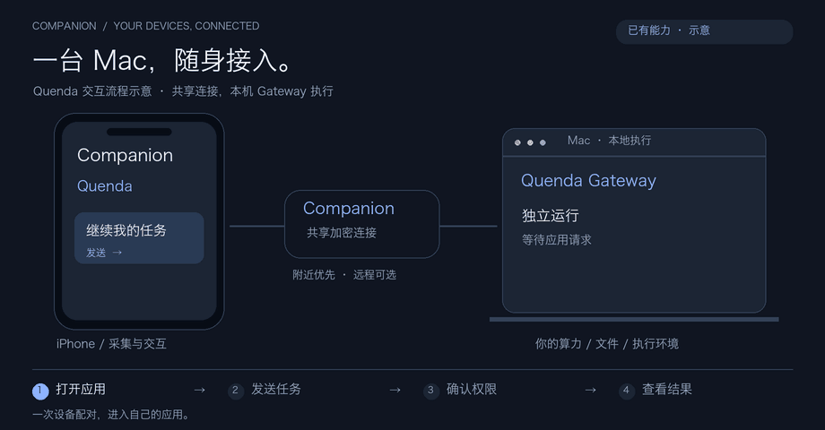
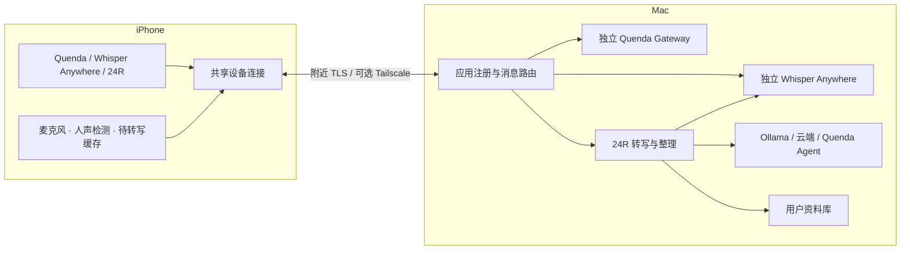

<div align="center">


# Companion

### 你的电脑负责运行，你的手机随时接入。

原生 Mac / iPhone 应用宿主，把 Agent、本地语音输入和全天记录带到自己的设备之间。


[快速开始](#快速开始) · [24R](#24r全天记录与一日回顾) · [安装说明](docs/getting-started.md) · [应用接入](docs/application-architecture.md) · [连接协议](docs/connection-protocol.md)

</div>

## 现在可以做什么

Companion 让个人应用从电脑延伸到手机。Mac 提供算力、文件和执行环境，iPhone 提供随身界面与麦克风；应用共用设备配对和加密连接，各自管理业务与数据。

| 应用 | 用途 | Mac 端依赖 |
| --- | --- | --- |
| **Quenda** | Agent 会话、流式回答、工具权限、项目与模型配置 | 独立运行的 Quenda Gateway |
| **Whisper Anywhere** | 把 iPhone 当作 Mac 的麦克风，识别后输入到光标或 Quenda 草稿 | 兼容的独立 Whisper Anywhere App |
| **24R** | 分段转写、小时摘要、情绪/场景标签、日报和待办，保存到自己的资料库 | Whisper Anywhere；整理可选 Ollama、云端模型或 Quenda Agent |

当前版本 **0.5.8（build 24）**。应用随宿主编译发布，尚不支持动态安装第三方应用。

> **连接状态说明：** 同一局域网（包括 Mac 连接手机热点）与可选 Tailscale 回退可用。0.5.8 修复点对点发现请求过早释放导致的解析超时／掉线；真机 AWDL 对照中，修复后空闲 93 秒仍可请求目录，恢复旧行为则解析超时。测试明确排除了 USB 传输。完整无共同网络使用、全天后台与耗电仍需长期验收。[排查进展](docs/nearby-connection-diagnostics.md)

## 两端界面

<table>
  <tr>
    <th>Mac · 管理应用与本地连接</th>
    <th>iPhone · 随身打开应用</th>
  </tr>
  <tr>
    <td align="center"></td>
    <td align="center"></td>
  </tr>
</table>

以上为早期版本截图；当前已加入 Whisper Anywhere 与 24R。

<details>
<summary>查看 Quenda 交互流程示意</summary>



流程动画为示意，非实际界面录屏。

</details>

## Quenda：从手机使用自己的 Agent

- 浏览 Agent、项目与会话，创建会话，读取分页历史与流式回答。
- 查看工具活动、确认权限、回复交互问题、停止回答。
- 配置 Provider、API Key 和默认模型；新会话可选择项目与模型。
- 渲染 Markdown、引用与代码块；选择照片和文件，查看传输进度。每条消息最多 6 个附件，合计不超过 8 MB，照片会压缩。
- 通过 Whisper Anywhere 将语音转成草稿，检查后手动发送。发送失败保留草稿，不自动重复发送业务命令。

Quenda Gateway 独立运行。Companion 不嵌入 Python，也不自动启动或停止 Gateway。Gateway 不可用时，不影响 Companion 的设备连接。

## Whisper Anywhere：手机麦克风输入

在 Mac 打开 Whisper Anywhere 并等待模型就绪，选中电脑的输入位置，然后在 iPhone Companion 中开始录音、结束并输入。模型、语言和辅助功能权限在 Whisper Anywhere 中设置。

声音经 Companion 传到 Mac 本地识别。独立输入页面显示录音与完成状态；Quenda 输入框可以显示转写预览，最终文字进入草稿。识别效果取决于外部 Whisper Anywhere 的模型和后端。

这是前台短时输入功能：单次最长 10 分钟；取消、系统中断或断线会取消本轮，不自动重发输入。手机可配置系统语音降噪。24R 使用麦克风期间，不能同时开启另一轮语音输入。

本仓库包含 Companion 适配器，**不包含独立 Whisper Anywhere App 或其 ASR 模型**。两者需使用兼容版本；24R 要求识别服务支持不落盘音频处理。

## 24R：全天记录与一日回顾

### 从记录到报告

1. **检测人声**：iPhone 本地使用 Silero VAD；不把纯静音作为单独片段发送。
2. **分段转写**：检测到说话后，约 3 秒无语音结束一段；持续说话最长约 60 秒提交一次。Mac 调用 Whisper Anywhere 转写，手机可查看已识别文本。
3. **小时摘要**：简短摘要，加上有依据的情绪、场景、主题标签，供回看与日报使用。
4. **一日回顾**：默认 21:30 生成，可修改时间或手动触发。整理活动顺序、重要事件、心情线索、困难与对策、值得肯定的进展，以及待办。

心情与活动分析依据转写文字；没有地点证据时只整理活动顺序，不代表 GPS 轨迹记录，也不根据声音诊断情绪或疾病。历史关联需要在设置中启用。

### 三种分析方式

| 方式 | 配置 | 执行方式 |
| --- | --- | --- |
| Ollama | Mac 可访问的服务地址、模型、驻留时间 | 代码控制多次模型调用，分项分析后汇总 |
| 云端模型 | OpenAI 兼容 Base URL、模型、API Key | 使用同样的多阶段工作流 |
| Quenda Agent | 专属 Agent ID，可选 Workspace / Provider / Model | 提交分析目标，由 Agent 自主组织推理与工具使用 |

本地 Ollama 地址中的 `127.0.0.1` 指 Mac。API Key 保存在 Mac 钥匙串。未配置整理模型时仍可记录、转写；选择云端服务时，用于分析的文字会发送到该服务。

### 音频与离线补传

默认**不长期保留原始音频**。待转写的完整片段会暂存到手机；Mac 确认处理且手机文字保存成功后删除。电脑断连时继续排队，重连后按顺序补传，失败不会直接丢弃缓存。

- 用户手动操作或启用明确关键词后，可以保留后续音频；不默认回溯。关键词依赖 Mac 转写结果，离线时不能作为即时触发器。
- 暂存为 16 kHz、单声道 PCM16：累计 1 小时片段约 **115 MB**，24 小时连续片段约 **2.76 GB**。实际取决于检测到的人声时长。
- 缓存上限 4 GB，剩余空间不足约 128 MB 时暂停并提示，不删除旧缓存。
- 已完成片段可跨 App 重启恢复；尚未结束、最长约一分钟的内存尾段，在强杀或系统终止时仍可能丢失。

支持从系统可用输入中选择内置、USB、有线或蓝牙麦克风，实际兼容性取决于设备向 iOS 暴露的输入能力。已实现后台录音和系统中断后的恢复逻辑，但不承诺电话、其他 App 独占麦克风期间仍能采集，也尚未完成全天锁屏、耗电和各型号蓝牙设备验收。

### 自己的资料库

Mac 可选择保存文件夹，按类似 Obsidian vault 的形式组织：

```text
24R/
  Transcripts/YYYY-MM-DD.json   # 可编辑的识别原文
  Transcripts/YYYY-MM-DD.md     # 派生阅读视图
  Hourly/YYYY-MM-DD.md          # 小时摘要与标签
  Reports/YYYY-MM-DD.md         # 一日分析报告
  Tasks/YYYY-MM-DD.md           # 待办与复选框状态
  .24r-vault.json               # 资料库格式标识
```

选择资料库后，它就是 **Mac 的主数据源**，不是另一份导出副本。App 内修改和外部文件编辑双向反映；App 只处理约定目录中的日期文件，其他文件夹可以用于自己的笔记和 Agent 输出。手机保留离线阅读副本。

编辑转写应修改 JSON；对应 Markdown 是阅读视图。编辑报告和小时记录时需保留格式元数据。资料库失联或损坏会报错，不切回旧内部数据继续写入。

[24R 使用、存储与实现边界 →](docs/24r.md) · [24R 静态设计原型 →](docs/prototypes/24r/README.md)

## 快速开始

需要 **macOS 14+、iOS 17+、Swift 6 编译工具**，并安装可用的 Xcode / iOS SDK。手机安装需要自己的开发签名。

```sh
git clone https://github.com/AgentDaily/companion.git
cd companion
scripts/build-apps.sh
open build/Companion.app
```

构建脚本生成 Mac App 和未签名 iOS SDK 产物；`build/iOS-SDK/QuendaCompanion.app` 不能直接安装到手机。

在 Xcode 打开 `Apps/iOS/QuendaCompanion.xcodeproj`，选择 `QuendaCompanion` scheme、自己的 Team 和 iPhone，然后运行。配置好开发签名后，也可以执行：

```sh
scripts/install-iphone.sh YOUR_TEAM_ID
# 多台设备时指定名称或 UDID：
scripts/install-iphone.sh YOUR_TEAM_ID '你的 iPhone 名称'
```

1. Mac 首页进入「设备连接与配对」，开启手机连接。
2. 首次使用建议两台设备连接同一个可互通的局域网，并允许 Companion 访问本地网络；局域网本身可以没有互联网。
3. 用 iPhone 相机扫描配对二维码，或在手机 App 粘贴配对链接。
4. 按需启动 Quenda Gateway / Whisper Anywhere，并在对应应用中检查连接。
5. 使用 24R 时，在设置中配置整理模型和 Mac 资料库位置，再开始记录。

远程访问可启用 Tailscale 回退，两端需加入自己的 Tailnet。Mac 必须保持运行和唤醒。只开 Wi‑Fi、未加入网络的点对点场景仍有已知问题，见开头的连接说明。

[完整安装说明 →](docs/getting-started.md)

## 两端如何协作



修改一个应用的配置不会主动关闭其他应用的共享连接。应用负责自己的任务恢复：聊天命令不自动重发，24R 则使用持久队列、完成确认与片段 ID 去重补传。

## 开发与验证

项目测试使用 Conda 环境 `kora`；隔离 Gateway fixture 需要该环境安装 `fastapi`、`uvicorn` 和 `websockets`。

```sh
conda run -n kora swift test
conda run -n kora scripts/test.sh
conda run -n kora scripts/build-apps.sh
```

`test.sh` 启动临时 Gateway fixture，验证聊天、权限、交互与重连，不调用真实模型。测试还覆盖 TLS、应用隔离、音频分段、离线队列、资料库双向更新、分析工作流与麦克风会话隔离。

0.5.8 最近一次全量测试：**118 项，112 通过、6 项可选测试跳过**；Mac release、iPhone SDK 和签名设备构建通过。自动测试不代表真实无线、全天后台或耗电验收。

```text
Sources/
  CompanionCore/        传输、应用协议、语音分段、24R 存储与分析
  CompanionUI/          共享界面、录音和连接状态
  QuendaCompanionMac/   Mac 宿主与菜单栏
Apps/iOS/               iPhone 宿主与 Xcode 工程
Tests/                  单元测试、音频样本与隔离 Gateway fixture
Vendor/                 VAD 第三方源码、来源与许可证
scripts/                构建、安装与测试
docs/                   使用说明、协议、设计原型与诊断记录
```

新增应用需要注册 Mac 业务会话和两端界面；应用目录不会为旧客户端自动安装新界面。[应用接入说明](docs/application-architecture.md)

## 数据与第三方组件

配对密钥与模型 API Key 保存在钥匙串。配对二维码和链接包含访问密钥，请勿公开。远程模式使用私有 Tailscale Serve，不启用公网 Funnel。选择本地模型可以在设备上处理；云端模型和部分 Agent 工具仍依赖外部服务。

本仓库附带 Silero VAD Core ML 模型与 libfvad 源码，不需要运行时下载 VAD 模型；第三方来源、版本及许可见 [Silero VAD](Vendor/SileroVAD/README.md)、[libfvad](Vendor/Libfvad/README.md) 和 [ThirdPartyNotices](Apps/iOS/ThirdPartyNotices.txt)。

## 后续方向

- 修复无路由器时的发现/连接问题，完善网络切换和后台实机验证。
- 完善 24R 识别质量、设备兼容性和耗电评估。
- 为摄像头、麦克风和文件传输提供统一应用能力接口。
- 探索独立应用包、运行环境、权限隔离与安装更新。

应用市场和动态第三方应用安装尚未实现。

---

Built by [AgentDaily](https://github.com/AgentDaily)
